# Clinical view radiograph set

These images are shown when **AI On → Clinical** is selected in the imaging
viewer (`FmxViewer` grid and `SingleImageViewer` single-image view).

## Filenames

One file per slot, zero-padded to two digits:

```
slot-01.png … slot-18.png
```

## No-bounce requirement

The viewer renders each image with `object-contain` inside a fixed box, so the
crop only stays stable across a Patient ⇄ Clinical swap if each clinical file is
exported at the **same pixel dimensions as its patient-view counterpart**
(`/public/xrays/slot-NN.png`). Match these exactly:

| file        | dimensions (WxH) |
| ----------- | ---------------- |
| slot-01.png | 364 x 276        |
| slot-02.png | 364 x 276        |
| slot-03.png | 360 x 476        |
| slot-04.png | 360 x 474        |
| slot-05.png | 358 x 476        |
| slot-06.png | 362 x 276        |
| slot-07.png | 364 x 278        |
| slot-08.png | 364 x 270        |
| slot-09.png | 364 x 276        |
| slot-10.png | 366 x 274        |
| slot-11.png | 366 x 274        |
| slot-12.png | 366 x 272        |
| slot-13.png | 364 x 272        |
| slot-14.png | 364 x 480        |
| slot-15.png | 358 x 482        |
| slot-16.png | 360 x 478        |
| slot-17.png | 364 x 276        |
| slot-18.png | 366 x 282        |

Any slot whose clinical file is missing automatically falls back to the patient
image (``), so a partial set won't break the view.
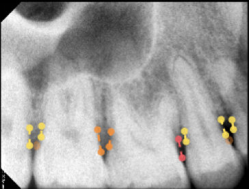
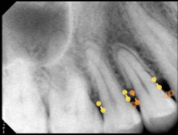
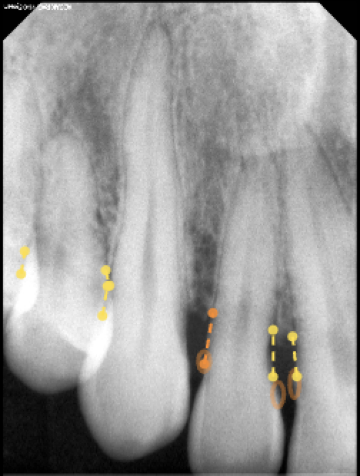
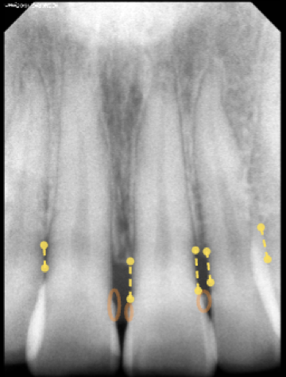
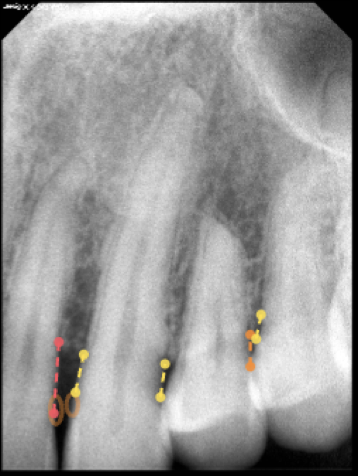
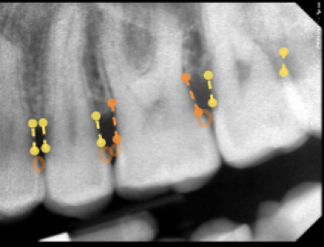
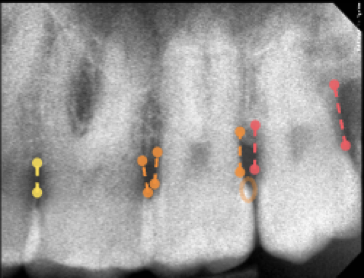
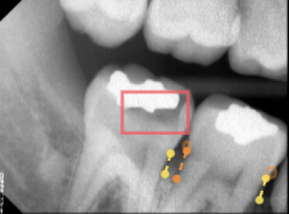
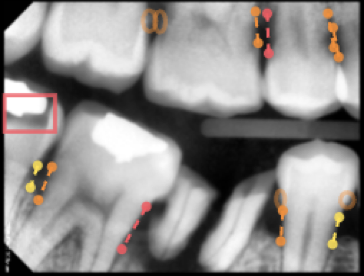
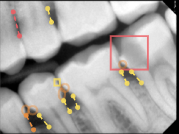
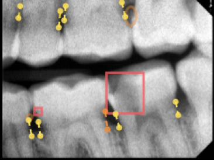
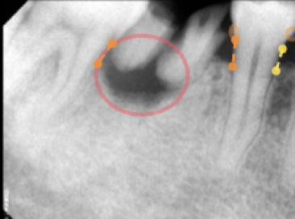
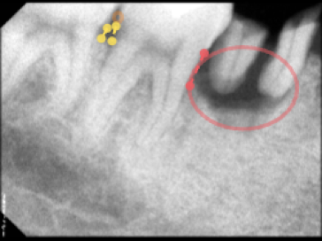
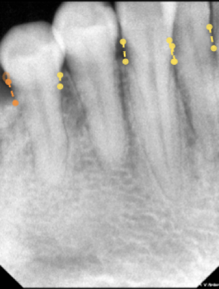
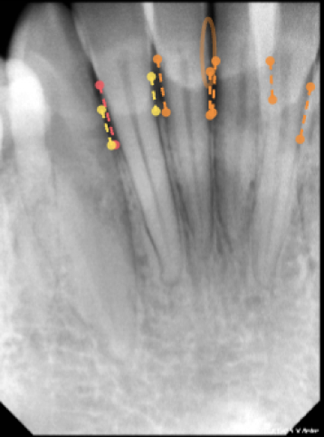
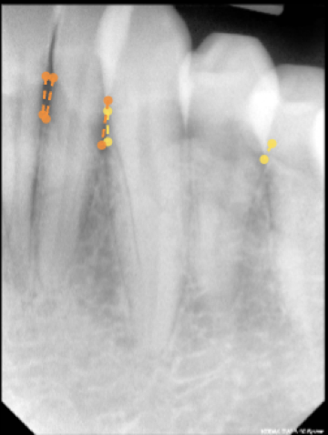
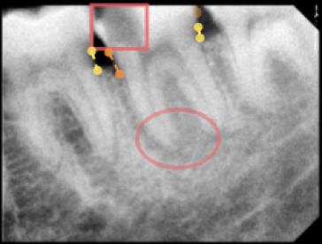
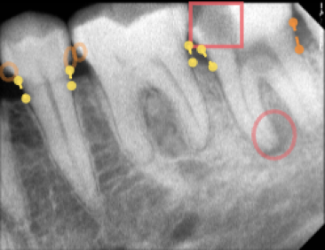
